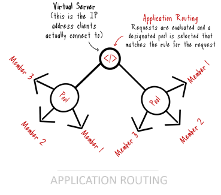

#Load Balancing Versus Application Routing
#负载均衡与应用路由

[原文](https://dzone.com/articles/load-balancing-versus-application-routing)

Load balancing and application routing may be provided by the same service, but are defined by key differences and distinct goals.

负载均衡和应用路由可能由同一服务提供，但是它们彼此有一些关键的区别和不同的目的。


As the lines between DevOps and NetOps continue to blur thanks to the highly distributed models of modern application architectures, there arises a need to understand the difference between load balancing and application routing. These are not the same thing, even though they might be provided by the same service.

由于现代应用程序架构高度分散的模式，DevOps和NetOps（网络运维）之间的界限变得模糊不清，因此需要了解负载均衡和应用路由之间的区别。 它们是不一样的，即使它们可能由同一服务提供。


Load balancing is designed to provide availability through horizontal scale. To scale an application, a load balancer distributes requests across a pool (farm, cluster, etc) of duplicated applications (or services). The decision on which pool member gets to respond to a request is based on an algorithm. That algorithm can be quite apathetic as to whether or the chosen pool member is capable of responding or it can be “smart” about its decision, factoring in response times, current load, and even weighting decisions based on all of the above. This is the most basic load balancing pattern in existence. It’s been the foundation for availability (scale and failover) since 1996.

负载均衡旨在通过水平扩展实现可用性。要扩展应用程序，负载均衡器会通过分发请求到应用程序（或服务）的池（服务器群，集群等）。 哪个池成员对请求做出响应的决定是基于一种算法。 该算法对于所选择的池成员是能够响应还是能够对其决策进行“智能化”，对响应时间，当前负载进行分解，甚至基于上述所有权重决策，可能是相当准确的。 这是现有的最基本的负载均衡模式。 自1996年以来，它一直是可用性（规模和故障转移）的基础。



Load balancing of this kind is what we often (fondly) refer to as "dumb." That’s because it’s almost always based on TCP (layer 4 of the OSI stack). Like the honey badger, it don't care about the application (or its protocols) at all. All it worries about is receiving a TCP connection request and matching it up with one of the members in the appropriate pool. It’s not necessarily efficient, but gosh darn it, it works and it works well. Systems have progressed to the point that purpose-built software designed to do nothing but load balancing can manage millions of connections simultaneously. It’s really quite amazing if you’re at all aware that back in the early 2000s most systems could only handle on the order of thousands of simultaneous requests.

这种负载均衡是我们经常（喜欢的）称为“笨蛋”。 这是因为它几乎总是基于TCP（OSI堆栈的第4层）。 像蜂蜜獾一样，它根本不在乎应用程序（或其协议）。 所有它担心的是接收TCP连接请求并将其与适当池中的其中一个成员进行匹配。 这不一定是有效的，但天啊，它是有效的，它的运作良好。 系统已经发展到专门设计的软件，除了负载均衡之外，还可以同时管理数百万个连接。 真的很惊奇，如果你完全知道，早在2000年代初，大多数系统只能处理数千个并发请求的顺序。


Now, application routing is something altogether different. First, it requires the system to care about the application and its protocols. That’s because in order to route an application request, the target must first be identified. This identification can be as simple as “what’s the host name” to something as complicated as “what’s the value of an element hidden somewhere in the payload in the form of a JSON key:value pair or XML element.” In between lies the most common application identifier – the URI.

现在，应用路由则是完全不同的。 首先，它要求系统关心应用程序及其协议。 这是因为为了路由应用程序请求，必须首先能够识别目标。 这个标识可以像“什么是主机名”一样复杂，像“JSON对象或XML元素形式的有效内容隐藏的元素的价值是多少”。 最通用的是应用程序标识符 - URI。

Application “routes” can be deduced from the URI by examining its path and extracting certain pieces. This is akin to routing in Express (one of the more popular node.js API frameworks). A URI path in the form of: /user/profile/xxxxx – where xxxxx is an actual user name or account number – can be split apart and used to “route” the request to a specific pool for load balancing or to a designated member (application/service instance). This happens at the “virtual server” construct of the load balancer using some sort of policy or code.

应用“路由”可以通过检查其路径并提取某些片段从URI中推导出来。 这类似于Express中的路由（流行的node.js API框架之一）。 形式为：/ user / profile / xxxxx（其中xxxxx是实际用户名或帐号）的URI路径可以拆分并用于将请求“路由”到用于负载均衡的特定池或指定的成员 （应用/服务实例）。 这种情况发生在使用某种策略或代码的负载均衡器的“虚拟服务器”结构中。


Application routing occurs before the load balancing decision. In effect, application routing enables a single load balancer to distribute requests intelligently across multiple applications or services. If you consider modern microservices-based applications combined with APIs (URIs representing specific requests) you can see how this type of functionality becomes useful. An API can be represented as a single domain (api.example.com) to the client, but behind the scenes, it is actually comprised of multiple applications or services that are scaled individually using a combination of application routing and load balancing.

应用路由发生在负载均衡决定之前。 实际上，应用程序路由使单个负载均衡器能够在多个应用程序或服务中智能地分发请求。 如果您将现有的基于微服务的应用程序与API（表示特定请求的URI）结合使用，您可以看到这种功能如何变得有用。 API可以表示为客户端的单个域（api.example.com），但在幕后，实际上由使用应用路由和负载均衡的组合单独调整的多个应用程序或服务组成。

One of the reasons (aside from my pedantic nature) to understand the difference between application routing and load balancing is that the two are not interchangeable. Routing makes a decision on where to forward something – a packet, an application request, an approval in your business workflow. Load balancing distributes something (packets, requests, approval) across a set of resources designed to process that something. You really can’t (shouldn’t) substitute one for the other. But what it also means is that you have freedom to mix and match how these two interact with one another.

了解应用路由和负载均衡之间的区别的原因之一（除了我的迂腐性质）是两者不可互换。 路由决定在哪里转发某些内容 - 数据包，应用程序请求，以及业务流程中的批准。 负载均衡将一些（数据包，请求，批准）分配到一组旨在处理该事物的资源。 你真的不能（不应该）替换另一个。 但这也意味着你可以自由地混合和匹配这两者之间相互作用的方式。


You can, for example, use plain old load balancing (POLB) for ingress load balancing and then use application routing (layer 7) to distribute requests (inside a container cluster, perhaps). You can also switch that around and use application routing for ingress traffic, distributing it via POLB inside the application architecture.

例如，您可以使用简单的旧负载均衡（POLB）进行入口负载均衡，然后使用应用程序路由（第7层）分发请求（可能在容器集群内）。 您还可以切换，并使用应用程序路由进入流量，通过应用程序架构中的POLB进行分发。

Load balancing and application routing can be layered, as well, to achieve specific goals with respect to availability and scale. I prefer to use application routing at the ingress because it enables greater variety and granularity in implementing both operational and application architectures more supportive of modern deployment patterns.

负载均衡和应用路由也可以分层，以实现可用性和规模方面的具体目标。 我更喜欢在入口处使用应用程序路由，因为它可以实现更加多样化和细粒度的实现运维和应用程序架构更支持现代部署模式。

The decision on where to use POLB vs application routing is largely based on application architecture and requirements. Scale can be achieved with both, though with differing levels of efficacy. That discussion is beyond the scope of today’s post, but there are trade-offs.

关于使用POLB和应用路由的决定在很大程度上取决于应用程序架构和要求。 尽管在不同层面上效率不一样，但两者都可以达到扩展性。 这个讨论超出了今天职位的范围，但有权衡。

It cannot be said often enough that the key to scaling applications today is about architectures, not algorithms. Understanding the differences of application routing and load balancing should provide a solid basis for designing highly scalable architectures. 

缩放应用程序的关键是架构而不是算法。 了解应用路由和负载均衡的差异应为设计高可扩展架构提供坚实的基础。


