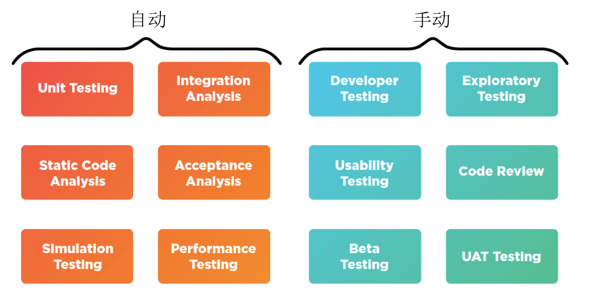
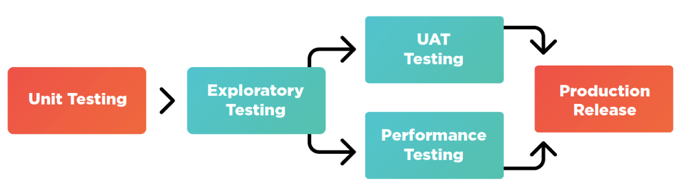

# 为持续交付做准备
### 建立您的DevOps流水线

### 原文地址

https://dzone.com/refcardz/preparing-continuous-delivery

## 总结

```
DevOps是一套实践方法，在保证高质量的前提下缩短系统变更从提交到部署至生产环境的时间. 其中持续集成和持续交付是DevOps里面非常重要的一环。

本文讲述了达到自动化持续交付需要做的准备工作，流水线构建方法和最佳实践。

王天青
DaoCloud 首席架构师 云原生转型实验室

```

## 目录

- 关于持续交付
- 目标
- 预备步骤
- 实现CD管道
- CD最佳实践及其他

## 关于持续交付

持续交付是一组能够帮助软件开发团队极大的提高其软件交付的速度和质量的模式和最佳实践组成。

不同于低频率发布相对较大的版本，实施持续交付的团队希望比通常更频繁将更小批量的变更投入生产， 例如每周，每天或同一天都可能发布多个版本。

这种软件交付方式可以带来许多的好处，正如Facebook，LinkedIn和Twitter等市场领导者所证明的那样，他们频繁地，以迭代方式发布软件，并取得了巨大成功。 然而，要达到那样的结果，需要对您的开发和交付方式进行一些潜在的重大变革。

本文详细地解释了这些要求，为准备从传统发布方式转向持续交付方式的开发和运维团队提供指导、建议和最佳实践案例。

## 目标

持续交付将在以下方面为您提供帮助：

* 尽可能快地交付软件，尽可能早地将有价值的新功能运用于生产
* 提高软件质量，系统正常运行时间和稳定性;
* 降低发布风险，避免同时在测试和生产环境部署失败;
* 减少浪费，提高开发和交付过程的效率;
* 使您的软件始终处于生产就绪状态，以便您可以随时部署。

## 预备步骤

为了达到目的，您首先需要有以下基础：

* 自动化测试等开发实践;
* 软件架构和组件设计，可帮助做更频繁的发布，而不影响用户，包括功能标志；
* 工具如源代码管理，持续集成，配置管理和应用发布自动化软件；
* 自动化和脚本化，使您能够以有限的人为干预重复构建，打包，测试，部署和监控软件；
* 组织，文化和业务流程的变化，以支持持续交付。

听到持续交付这个词，有些人的第一个担忧就是这是否意味着软件质量标准将会下滑，否则团队需要走捷径才能实现软件的频繁发布。

事实恰恰相反，为了支持持续交付而采取的措施和体系几乎肯定会提高软件发布的质量，并且在软件版本出错时将给予您额外的安全防护。

您的软件仍然会经历与现在相同的严格测试阶段，可能包括手动质量检查测试阶段。持续交付只是让您的软件以最严格和最有效的方式在您设计的流程中流转，从开发一直到生产。


### 连续交付的关键构建模块：自动化！

尽管在持续交付流程中采取手动步骤是非常有效和现实的，但自动化是加快交付步伐和缩短周期时间的关键。

毕竟，即使拥有再丰富资源的团队，手工构建，打包，编译，测试和部署软件也是不可行的，尤其是软件很大或者复杂的情况下。

因此，最重要的目标应该是使开发者和生产环境之间的大部分路径自动化。 以下是您应该专注于自动化工作的一些主要领域。

### 自动化构建和打包

需要实现自动化的第一件事就是将开发人员的源代码转换为部署就绪制品的这个过程。

虽然大多数软件开发人员使用诸如Make，Ant，Maven，NuGet，npm等工具来管理其构建和打包，但是许多团队在制作好准备发布的制品之前仍需要执行一些手动步骤。

这些步骤是实现持续交付的重大障碍的代表。 例如，如果每三个月发布一次，手动构建与安装就显得不那么繁杂。但是，如果您希望每天或每周发布多次，那么这个任务完全可靠地自动化会更合适。

| 目标:|
|:---|
|实现单个脚本或命令，使您能够将版本控制的源代码转换为单个可部署的制品。|


### 自动化持续集成

持续集成是持续交付的基本组成部分。

它涉及整合多个开发人员的代码，并不断编译和测试集成的代码库，以便尽可能早地识别错误。

理想情况下，此过程将利用自动化构建，从而使您的持续集成服务器不断地发布包含开发团队集成工作的部署制品，每个构建的结果都是可行的发布候选。

通常，您将建立一个连续集成服务器或相关云服务（如Jenkins，TeamCity或Team Foundation Server），每天可能会执行多次集成，很可能在每次提交时触发。

第三方持续集成服务，如DaoCloud Service，CloudBees DEV@cloud，Travis CI或CircleCI可以帮助您加快您的持续集成进度。 通过外包您的持续整合平台，您可以自由地专注于持续交付的目标，而不是管理工具和基础架构。

| 目标: |
| :------|
|实现持续集成过程就是持续输出一组可用于部署的制品 |
|评估基于云的持续集成产品，以加快您的持续交付进程 |
|通过发布跟踪软件（如Jira）的集成，整合对每个构建所发生变化的详细审计跟踪|

您的持续集成工具可能对您的持续交付工作至关重要。 例如，它可以超越构建并进入测试和部署。 因此，持续集成是您持续交付战略的关键要素。

### 自动化测试

虽然持续交付可以（并且经常）包括由质量保证团队执行的手动测试阶段或最终用户验收测试，但是自动测试几乎肯定将是您加快交付周期并提高质量的关键功能。

通常，您的持续集成服务器将负责执行大多数的自动化测试，以验证每个开发人员提交的代码。

然而，当系统部署到测试环境中时，某些自动化测试可能会被需要执行，因此您还应该尽可能多的实现自动化测试。您的自动化测试应该是详尽的，能够覆盖测试应用程序的多个方面：

|测试类型|工作内容|
|:--|:--|
|单元测试|底层函数和类在不同输入条件下按照预期工作|
|集成测试|集成模块与消息队列及数据库等基础设施协同工作|
|验收测试|通过用户界面测试关键用户操作流程，并将您的应用程序作为一个完整的黑盒子|
|负载测试|测试您的应用程序在模拟的真实用户负载下是否运行良好|
|性能测试|该应用程序在实际负载情况下满足性能要求和响应时间要求。|
|模拟测试|您的应用程序在设备仿真环境中工作。这在移动端尤其重要，您需要在各种模拟的移动设备上测试软件。|
|冒烟测试|验证新部署环境的状态和完整性|
|质量测试|应用代码是高质量的 - 通过静态分析，代码风格指南，代码覆盖度等技术来识别。|

理想情况下，这些测试可以分布在部署流水线中，随着流水线中的测试越来越详细和价值越来越高，在生产环境中，这些发布候选工件看起来越来越可靠。其目标应该是尽早确定有问题的构建，以避免返工，尽快缩短周期时间和获得反馈。

| 目标: |
| :------|
|让您的测试尽可能多的实现自动化 |
|提供针对代码部件和部署系统的多级抽象的良好测试覆盖 |
| 在您的部署流水线中分发不同类别的测试，模拟日后的生产环境并进行更加详细的测试，同时避免人力返工。|

在微服务风格的环境中，跨部署组件的集成和协同测试越来越重要。在这样的环境中，自动化部署所有必需的应用程序（见下一节）的功能成为高优先级的任务。

自动化测试是您发布高质量软件的主要防线，投资这些测试可能是昂贵的，但这一系列的自动化测试将在应用的整个生命周期内提供持续帮助。

### 自动化部署

软件团队通常需要将发布后续推送到不同部署环境进行上述讨论的不同类别的测试。

例如，常见的情况是将软件部署到测试环境进行人为的质量检查测试，然后部署到性能测试环境，进行自动化负载测试。 如果构建通过该测试阶段，则应用程序可能稍后部署到用于UAT或beta测试的单独环境中。

理想情况下，将任意发布候选部件以及与之通信的其他系统可靠地部署到任意环境中的这个过程应尽可能实现自动化。

如果您希望按照计划的速度持续交付，那可能需要每天或每周多次执行此，因此它的工作速度和可靠性至关重要。

用自动化方式在环境之间移动软件是作为继续交付的团队的主要特性之一，因此这也是继续交付的关键重点


|目标:|
| :------|
|能够简化化的在任意环境中部署发布某任意特定版本。|
|使用冒烟测试确保部署的系统的可用性。|
|加强部署过程，使其永远不会使环境处于断开或部分部署状态。|
|将自助服务功能纳入此过程，因此质量保证人员或业务用户可以选择软件版本，并在其方便部署。 在较大的组织中，此过程应包含业务规则，使特定用户具有特定环境的部署权限。|
|评估应用的版本自动化工具，以加快持续部署能力。|


### 受管理的基础架构和云服务

在持续的交付环境中，可能希望具有更多灵活性和敏捷性来应对环境的创建和拆除，应对项目不断变化的需求。

如果要启动新的环境以添加到部署流水线中，并且该过程需要几个月的购买硬件，配置操作系统，配置中间件并将其正确部署，敏捷性受到严重限制，你的交付能力受到限制。


利用虚拟化和基于云的产品可以帮助你。 考虑像Amazon EC2，Microsoft Azure或Google Cloud Platform这样的云端主机，您可以根据项目的要求灵活地开发新的环境和新的基础架构。

云也可以为生产应用程序做出最佳选择，使你在开发和生产环境中实现高度的一致性。

|目标：|
| :------|
|为持续交付流程提供更多灵活性，以便您可以按需伸缩你的流水线。
|在云中实施持续的交付基础设施，能够快速推出新环境，并在需求减少的情况下暂停或拆除这些环境。|


### 基础架构即代码

当配置方面不一致时候，例如当开发环境与测试不同，或当测试环境与生产不一致时，会发生非常常见的一系列生产事件，错误最终导致返工。

配置管理工具（如Puppet，Chef，Ansible或Salt）和环境建模工具（如Vagrant或Terraform）可帮助您通过将基础架构和平台提供版本控制代码来避免这种情况，然后将环境自动构建成非常一致和可重复。

结合云和外包基础设施，这种鸡尾酒【混合模式】可以让您轻松部署准确配置的环境，从而为您的交付速度带来真正的提升。

Vagrant和Terraform也可以为开发人员提供非常一致和可重复的开发环境，可以在自己的机器上进行虚拟化和运行。 容器（见下一节）是实现此目的的另一个常用选项。

这些工具都非常重要，因为环境的一致性是允许软件以一致和可靠的方式流过流水线的巨大推动力

|目标:|
|:----|
|实施配置管理化，更加全面地控制构建环境，特别是与云结合使用。|
|Vagrant，Terraform和容器框架，以此为开发者提供非常一致的本地开发环境。|

### 容器技术

另一种方式，容器在持续交付准备中的某个时刻很可能会出现：无论是作为生产环境的新运行时间，或者创建可重复的本地开发设置的更轻量级的手段，还是简单的跟踪技术潜在的未来使用。

如果您决定尝试将应用程序集中起来，请确保您还可以调查业务流程框架，如Docker Swarm，Mesos或Kubernetes，这将允许您将相关容器组定义和控制为单个版本化实体。

如果您计划在容器上运行生产环境，请确保您选择的业务流程框架也可用于本地开发。否则，再次存在容器在开发机器上“联系起来”的方式的风险与生产中将会发生什么不一致。

### 自动的生产部署

虽然大多数软件团队的构建和测试都具有一定程度的自动化，但是在生产服务器上部署的实际行为通常仍然是典型软件团队最为人为的过程之一。

例如，团队可能会将多个二进制文件推送到多个服务器上，一些手动执行的数据库升级脚本，然后是一些手动安装步骤来将它们连接在一起。他们通常也会执行系统启动的手动步骤和冒烟测试。

由于这种复杂性，发布经常发生在营业时间之外。事实上，一些不幸的软件团队必须在星期天早上凌晨3点进行升级和定期维护，以免对客户群造成最小的影响！

要实现持续交付，您需要解决这一痛苦，并缓慢地编写脚本并自动从您的生产发布过程中手动执行步骤，以便可以重复和一致地运行。理想情况下，您将需要到达您在业务过程中可以做到的阶段

系统正在使用的时间。这可能会对系统的体系结构产生重大影响。为了使系统在使用中每天进行多次生产，重要的是要确保该过程也经过测试和加固，以免由于部署失败而使生产应用程序处于断开状态。

|目标:|
|:----|
|完全自动化生产部署过程，使其可以从单个命令或脚本执行。|
|在生产系统生效的同时，可以部署软件的下一个版本，并切换到新版本，而不会降低服务质量。|
|能够使用完全相同的部署到其他环境的进程部署到生产。|
|实施下面描述的最佳做法，例如金丝雀释放，回滚和监控，以提高生产系统的稳定性。|


## 实现持续交付流水线

交付流水线是一个简单但关键的模式，为您提供实现持续交货的框架。

流水线的描述如下：

* 软件在从源代码控制到生产的路径之间的显式阶段;
* 哪些阶段是自动化的，哪些阶段有手动步骤？
* 在流水线阶段之间移动的标准是什么，捕获哪些网关是自动化的，哪些是手动的？
* 哪些步骤可以并行

重要的是，交付流水线的概念让我们了解我们发布候选人的生产准备情况。

例如，如果您知道您在UAT中有发布候选，以及即将通过一系列附加功能进行性能测试的发行人候选，则可以使用它来决定如何，何时以及要发布到生产。


### 步骤1：建立您的流水线

建立交付流水线的第一步就是识别出从源码控制到生产部署之间的各个阶段。

典型的软件开发团队将有一些可供选择，其中一些是自动化的，其中一些是手动的：



在实施持续交付的同时，您可能希望借此机会添加超越你今天所做的工作。

例如，也许增加自动验收测试将减少所需的手动测试的范围，加快开发周期并增加您的持续交货的能力。也许添加自动性能测试或手动用户测试可以让您缩短周期时间，进一步发布并更频繁地发布。

确定了哪些阶段对您很重要，然后您应该考虑如何将阶段安排到有序的流程中，并注意到每个阶段的投入和产出。流水线的一个非常简单的例子可能如下所示：


不过，每个软件团队都会以微妙的方式做事情。例如，根据您的舒适度和自动化测试的水平，您可以决定跳过任何形式的探索性测试，并完全依赖于自动测试过程，将管道的长度缩短到非常短的全自动化过程：


其他团队可能会选择并行化流程和测试阶段。这在测试是手动的和阶段是耗时的时候特别有用 - 在您的持续集成之旅开始时，相当可能的前景。

与UAT同时运行性能测试可能是这种并行化的一个例子。当事情进展顺利的时候，这显然可以加快端到端的交付过程，但如果流水的一个分支发生故障，并且发布候选人被拒绝，可能导致浪费的努力：




上面的管道非常简单，但说明了您需要在建模流程和实施管道时做出的决策。最好的管道并不总是很明显，需要权衡:

理想情况  | 折中考虑
------------- | -------------
所有阶段和网关都将自动化。  | 需要大量投资自动化测试和发布自动化。
始终避免昂贵的人工重新工作。  | 如果测试阶段较慢且手动，则需要将测试阶段并行化，从而在管道的另一个阶段出现失败的候选人的风险。始终执行自动化测试。
始终执行自动化测试 | 详细的自动测试在诸如环境的生产中也是昂贵的。
准备大量环境来支持各测试阶段。| 维护环境具有相关的管理和财务成本。

无论您对各种权衡采取何种立场，交付流水线的建模的输出应该是一个基本的流程图，记录了软件从源代码到生产的路径。

###步骤2: 识别非自动化的活动和网关

如前所述，您最好将流水线的所有阶段自动化。

在这个理想的世界中，开发者将要提交代码，然后通过流水线将发布候选者发布出去，每个步骤和各阶段之间的每个网关都自动化。合格的发布候选版本将被放在流水线的末端以备部署，而你会对每个人都抱有信心。但是，由于各种各种的原因，这并不总是行得通。例如，常见的问题是要求手动用户验收或beta测试的自动化测试或业务需求量不足。即使在高度自动化测试的地方,许多企业在构建通过流水线到达生产之前都需要人工签字。

因为这些原因，我们的交付管道的确需要通知，建模，以及在过程中允许人为和手工操作。

在某些情况下，你会发现各个阶段的网关也可以自动化。比如，如果软件在持续集成服务器中通过了自动化测试，你将会允许它进入一个开发-性能测试自动化的环境。但是你可能希望由QA同事去掌控测试环境发布的探索性，这种方式是人工的，甚至是自我服务的步骤。

对于自动化和人工化两个途径，你都希望去确定通过它们的标准。如果有一个标准没有被满足，那么系统就应该从交付流水线中去阻止候选者的发布。

### 步骤3：实现你的管道

一旦你为了管道流建立了模型，你将在之后的实际实现中感到乐趣。如果你能使编译、测试、和发布都变的自动化，那么你就会很好的在一个发布流水线上下文中把它们变得紧密。

### 软件和工具


为了管理你的管道，你将要在构建合适的脚本和致力于实现过程的现成的应用发布自动化工具二者之间做出选择。

不要在供应工具上打折扣，因为这将会潜在的解放优秀的开发者和系统管理员的时间，省下的时间或者可以用于管理内部基础设施或者开发发布自动化胶水代码。这种优秀的软件将会：

* 标准化流水线各阶段和流程；
* 定义发布候选者在流水线中流转的标准；
* 在合适的地方让你在流水线并行；
* 为管理和操作提供部署的报告和审计；
* 让你能监视到你的流水线，构建进度以及各个发布候选者之间显著的改变；
* 给你的团队自服务的基础设施，比如让操作者发布产品以及在其就绪的时候让QA把版本放置于他们的测试环境。
* 可以进行权限管理，以便只有某些授权人员具有部署权限。

## 持续交付最佳实践

一旦基础就绪并建立好交付流水线，你很可能已经从迭代时间以及快速发布中收益。

自动化会取代很多人工任务，环境和发布会变的一致，发布候选者将使用自动路由和自助服务工具在各个流水线阶段中流动。

你的软件应该近似于时刻处在生产就绪状态，伴随着发布候选人最后从流水线的出来的频率远大于从传统途径的频率。每个发布候选者应该增加一批相对较小的改动。

一旦你处于这个阶段，那么你常常会有更多机会去提升和推进更快的发布周期，而这会是你的系统的稳定性更强。

下面列举了一些最佳实践

### 实施监控

尽管这份文档讨论的所有事情是描述一个严格的过程去帮助你避免在发布产品的时候出现bug，但是一旦发布结果显示出系统出现了某种故障，那么收到告急同样显得非常重要。

举个例子，如果你的应用在部署结束之后开始抛出告警和异常，那么被直接告之就显得极其重要，这意味着你可以调查和结局。

理想情况下，这种警示将会以仪表盘或者监控终端的途径传递，比如邮件，文本消息，Slack，或者功能类似的其他途径。

你可能会需要更加深入而不仅仅是简单的检查错误日志，并且开始监视应用程序正在打印出的日志。

比如，如果你的购物车完成了在一个发布后下降了20%，这可能预示着上一个发布的一个微妙但是严重的错误。诸如StatsD和Graphite之类的开源工具以及通信和浏览分析工具Google Analytics会在此帮助到你。

同样的，这些指标应该在可能的情况下加入到你的监视和警告的仪表盘当中。

 
有许多有价值的开源和商业工具可以帮助你智能的去监控你的应用。这些都是值得评估作为一个快速和符合成本效益的手段，支持你的连续交付项目。

|目标:|
|:----|
|为了实时监控你的应用，最理想的方法应该是通过可视化的仪表盘。|
|追踪应用的关键度量，如果部署出现负面的影响就使其发出警报。|

###实现回滚

使你的生产环境具备快速可靠的回滚是最后的安全网。

如果一个bug在你的所有手动和自动的测试中通过，那么回滚将使应用在许多用户受到影响之前快速回到之前可用版本。

伴随着一个优秀的回滚途径带来的益处，你将在自动交付流水线和打开各个阶段之间的大门变得更加有野心。

这种信心会带来更快速度的发布，在发布流程中加入自动化会让你变得更有信心。

如果发布流水线实现的非常好，你应该不用花费额外代价就能得到这种回滚能力。如果版本9发生了故障，部署版本8就好了，它应该同样可用，所有签署和准备重新部署在您的管道末端。

|目标:|
|:----|
|为快速重复的回滚任何软件提供一种机制。|
|将其构建在流水线流程中，以减少开发者显示的为回滚编码。|
|定义的去测试你的回滚机制，作为测试管道的一部分，以保持你对流程的信心。|

### 提取特异于环境的配置

在流水线中正确并且一致的去使用二进制包和产品是很重要的。如果QA和UAT在开展工作的过程中不同的二进制包，那么你的测试完全是无效的。

基于这个理由，你需要获得将同样的应用二进制包推进任意环境的能力，接着分开发布环境特异的配置。这种配置应该像其他任何代码一样进行版本控制，这使得你获得更多的复用和更好的审计。

确实，这样做最大的阻碍是拥有环境特异的配置会和实际的二进制包紧密的耦合在一起。

将这些环境特异的配置提取出来，放到额外的属性文件或者其它配置源会使你获得对待此类阻碍更大的敏捷性。

|目标:|
|:----|
|在你的交付流水线中使用同样的二进制包。避免重新构建源或者以任何方式处理二进制文件，即便你觉得这样做是安全的。|
|将环境特异的信息提取到版本控制的配置，这会使其从主要的发布产品中分开。|

### 执行金丝雀发布

一个增加产品环境稳定性的有用的技术是金丝雀发布。这个概念涉及到将你的软件的下个版本发布到生产中，

但是只将其暴露给你的用户的一小部分。这可以被做到，例如，使用一个负载均衡器仅仅将一小部分比例的信号量定向到新的版本。

尽管我们的目的从来都不是将任何bug引入到生产环境中，很明显，你更愿意将大部分用户与任何问题隔离起来。

当你在发布过程中建立了信心，随后你可以增加新版本对用户的暴露的数量，知道完全取代旧版本。

金丝雀发布在持续交付的一个重大的胜利，但它需要更多额外的工作和应用架构上的变化。

|目标:|
|:----|
|进行金丝雀发布，同时不影响生产版本被用户正常使用。|

### 捕捉构建审计信息

理想情况下，你的持续发布流水线应该会给你带来一个清晰的途径，关于每个发布候选者的变更。手动测试可以特定的去关注改变过的区域，在你知道每个发布的实际范围后你会更有自信的前进。

通过在持续集成服务器上集成问题追踪软件诸如Jira和Pivotal Tracker，你可以开发高度自动化的系统发，发布说明可以被构建和链接回到个别问题或缺陷。

你应该确保为了可追踪性和可调查性去捕捉被发布到某个环境的所有二进制文件，仓库管理工具诸如Nexus和Artifactory在此非常有用。也有很大一批工具，作为容器镜像作为专门的登记。

|目标:|
|:----|
|集成问题追踪软件或者变更管理软件将会为每个发布候选着定位到详细的问题审计信息。|
|变更控制所有相关的代码以及归档所有发布过的二进制文件。|


### 实现功能开关

功能开关是一个开发者构建进软件的设施，以获得在一个较高水准的粒度上切换不同特性的能力。这项简单的技术可以通过加大控制如何使新的特性投入生产使用以增加系统的可靠性。

一个优秀的功能开关将会：

* 在运行时被管理而不需要重启或者中断用户。
* 良好测试，这意味着你应该确保你的测试覆盖了所有你将要计划在生产使用的新特性的组合。
* 运行时识别，允许你识别哪个特性在什么场景下被激活，以及他们与系统用量之间的关系。

简单的特性标志可能看上去会简单的构建自己。你可能会喜欢快速发现，然而，你的功能开关实现所需的功能数量迅速扩展：历史比较，审计跟踪和基于角色的访问控制的名称，但是不多。

|目标:|
|:----|
|实施功能开关，充分了解对质量检查和生产操作的影响。|

### 使用基于云和管理基础设施

在这篇文章的多个地方，很多云和基础管理提供商被提及。这是因为他们代表了一种快速和成本效益的方式，加快您的持续交付努力。

云和管理基础设施即服务在支持在构建和发布基础设施时有诸多需求的团队时显得格外有用。比如你可能会发现在你进行发布时，你需要暂时提升你的容量。

云和自动化基础设施管理的结合是处理CI中的变化理想选择。基于这个理由，云托管业务诸如DaoCloud Service，DEV@cloud、Travis CI、CircleCi是外包您的连续交付基础设施的理想候选人。

|目标:|
|:----|
|减少基础设施管理投入，并通过部署到云或基础设施服务使其支持变化的需求。|

## 检查列表

### 基础原理 - 发布自动化：
* 自动化构建和打包
* 自动化持续集成
* 自动化测试
* 自动化部署
* 受管理的基础架构和云
* 基础架构即代码
* 容器框架
* 自动化生产部署

### 实现一个持续交付流水线
* 流水线建模
* 识别非自动化的活动和网关
* 实现流水线

### 最佳实践
* 实现监测
* 实现回滚
* 提取特定于环境的配置（配置与代码分离）
* 执行金丝雀发布
* 记录审计信息
* 实现功能开关
* 使用基于云的基础架构
