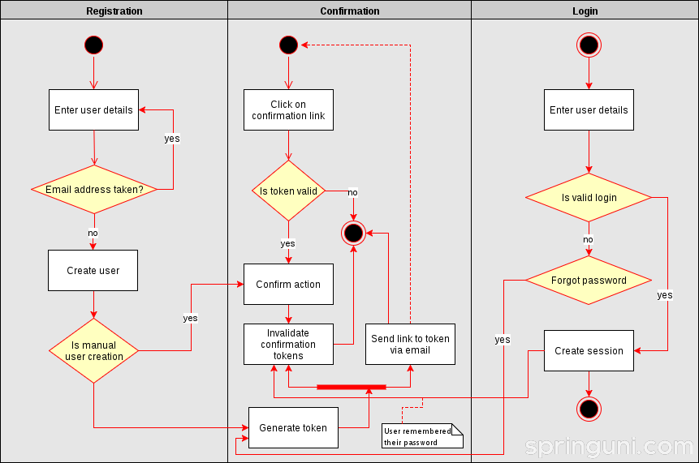
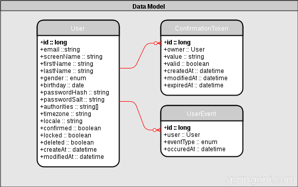

# Building a user management microservice (Part 1): Defining the domain model and a REST API

# 构建用户管理微服务（第1部分）：定义领域模型和REST API

In this first part we define the requirements against the application, its initial domain model and that REST API which its front-end will be using. We start off by defining the user stories for registering and managing users.

在第一部分中，我们会定义应用的需求，初始的领域模型和供前端使用的REST API。 我们首先定义用户注册和管理用户的故事。

## User stories

## 用户故事

When designing a new system, it’s worth thinking about that result users are expecting to achieve with it. Below you can found a list of those very basic features a user registration system should have.

在设计新系统时，值得考虑的是用户希望实现的结果。 下面您可以找到用户注册系统应具有的基本功能的列表。

* As a user, I want to register, so that I can get access to content which requires registration
* As a user, I want to confirm my email address after registration
* As a user, I want to login and log out
* As a user, I want to change my password
* As a user, I want to change my email address
* As a user, I want to be able to reset my password, so that I can login after I lost my password
* As a user, I want to update my profile, so that I can provide my correct contact data
* As a user, I want to close my account, so that I can close my relationship with that service I signed up for
* As an admin, I want to manage (create/delete/update) users manually, so that staff members wouldn’t have to go over the registration process
* As an admin, I want to create users manually, so that staff members wouldn’t have to go over the registration process
* As an admin, I want to list all users, even those once who closed their account
* As an admin, I want to be able to see users’ activity (login, logout, password reset, confirmation, profile update), so that I can comply with external audit requirements

* 作为用户，我想注册，以便我可以访问需要注册的内容
* 作为用户，我想在注册后确认我的电子邮件地址
* 作为用户，我想登录并注销
* 作为用户，我想更改我的密码
* 作为用户，我想更改我的电子邮件地址
* 作为用户，我想要重置我的密码，以便我忘记密码后可以登录
* 作为用户，我想更新我的个人资料，以便我可以提供我正确的联络资料
* 作为用户，我想关闭我的帐户，以便我可以关闭我与我注册的服务的关系
* 作为**管理员**，我想手动管理（创建/删除/更新）用户，以便工作人员不必重新进行注册过程
* 作为**管理员**，我想手动创建用户，这样工作人员就不用再过注册过程了
* 作为**管理员**，我想列出所有用户，即使是那些曾经关闭帐户的用户
* 作为**管理员**，我希望能够看到用户的活动（登录，注销，密码重置，确认，个人资料更新），以便我可以遵守外部审计要求

## Workflows

## 工作流程

Let’s take a look at the workflows what system is going to support. First of all, people should be able to register and login, these are fairly obvious functionalities.

我们来看看系统将要支持什么样的工作流程。首先，人们应该能够注册和登录，这些是相当明显的功能。

However, we need to be cautious when it comes to the handling of confirmation tokens. As they can be used to perform privileged actions, we use disposable random tokens to handle password reset and email confirmation.

但是，处理确认令牌时需要谨慎。 由于它们可用于执行特权操作，因此我们使用一次性随机令牌来处理密码重置和电子邮件确认。

When a new token got generated by the user for whatever reason all the previous ones are invalidated. When some remembers their password, formerly issued and valid password reset tokens must be made expired.

当一个新的令牌由用户生成，无论什么原因，所有以前的都是无效的。 当有人记住他们的密码时，以前发出的和有效的密码重置令牌必须过期。

## Non-functional requirements

## 非功能性需求

User stories usually don’t define non-functional requirements, such as security, development principles, technology stack, etc.  So let’s list them here separately.

用户故事通常不会定义非功能性要求，例如安全性，开发原理，技术栈等。所以我们在这里单独列出。

* The domain model is implemented in pure Java using Domain-driven design principles and its independent of the underlying technology stack to be used
* When users log in, a JWT token is generated for them, which is valid for 24 hours. By providing this token for subsequent requests they can perform operation which require authentication
* Password reset tokens are valid for 10 minutes and email address confirmation tokens for a day
* Passwords are encrypted with a cryptographically strong algorithm (Bcrypt) with per-user salt
* A RESTful API is provided for interacting with the user registration service
* The application will have a modular design in order to be able to provide separate deployment artifacts for various scenarios (eg. a 2.5 servlet compliant WAR for Google App Engine and a Spring Boot-based, self contained, executable JAR for other use cases)
* Entity identifiers are generated in a database agnostic way, that is, no database specific mechanism (AUTO_INCREMENT or sequences) will be used to get next ID values. The solution will be similar how Instagram genetes IDs.

* 领域模型是使用域驱动的设计原则在纯Java中实现的，并且独立于要使用的底层技术栈
* 当用户登录时，将为他们生成一个JWT令牌，有效期是24小时。在后续请求中包含此令牌，用户可以执行需要身份验证的操作
* 密码重置令牌有效期为10分钟，电子邮件地址确认令牌为一天
* 密码用加密算法（Bcrypt）加密，每用户盐
* 提供了RESTful API，用于与用户注册服务进行交互
* 应用程序将具有模块化设计，以便能够为各种场景提供单独的部署工件（例如，针对Google App Engine的2.5 servlet兼容WAR和其他用例的基于Spring Boot的自包含可执行JAR）
* 实体标识符以数据库无关的方式生成，也就是说，不会使用数据库特定机制（AUTO_INCREMENT或序列）来获取下一个ID值。解决方案将类似于Instagram genetes ID。

## Domain Model

## 领域模型

For the first round implementation we’ve got only three entities, that is, User, ConfirmationToken and UserEvent.

对于第一轮实现中，我们只关注三个实体，即用户，确认令牌和用户事件。

## REST API

Accessing most of endpoints below require authentication, otherwise they return an UNAUTHORIZED status code. They also return a client error (FORBIDDEN) if the user tries to query an entity which belong to some other user, unless he has administrative privileges. If the specified entity doesn’t exist the called endpoint returns NOT_FOUND.

访问下面的大多数API都需要认证，否则返回一个UNAUTHORIZED状态码。 如果用户尝试查询属于某个其他用户的实体，则他们还会返回客户端错误（FORBIDDEN），除非他具有管理权限。 如果指定的实体不存在，则调用的端点返回NOT_FOUND。

Creating a session (POST /sessions) and registering a new user (POST /users) are public and they don’t require authentication.

创建会话（POST /sessions）和注册新用户（POST / users）是公开的，它们不需要身份验证。

### Session management

~~~
GET /session/{session_id}
~~~

Returns the details of the given session or NOT_FOUND if there is no such session with the given ID or if that’s already expired.

如果没有给定ID的会话或者会话已经过期，则返回给定会话的详细信息或NOT_FOUND。

~~~
POST /session
~~~

Create a new session provided that the specified email and password pair belongs to a valid user.

创建新会话，前提是指定的电子邮件和密码对属于一个有效的用户。

~~~
DELETE /session/{session_id}
~~~

Deletes the given session (logout).

删除给定的会话（注销）。

### User management

~~~
GET /users/{user_id}
~~~

Finds a user with the given ID.

根据一个指定的ID查找用户

~~~
GET /users
~~~

List all users in the system

列举系统中所有的用户

~~~
POST /users
~~~

Registers a new user

注册一个新的用户

~~~
DELETE /users/{user_id}
~~~

Deletes the given user.

删除指定的用户

~~~
PUT /users/{user_id}
~~~

Updates the profile of a given user.

更新指定用户的个人信息

~~~
PUT /users/{user_id}/tokens/{token_id}
~~~

Uses the token of the given user and performs the action related to the token’s type.

使用给定用户的令牌执行与令牌类型相关的操作。

